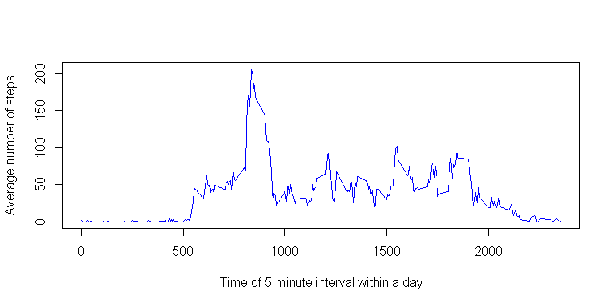
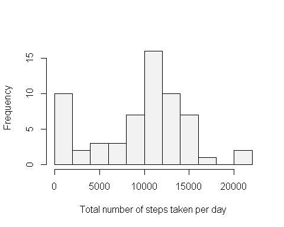
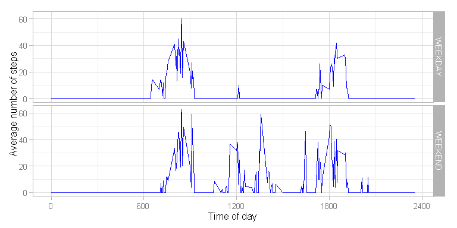

# Reproducible Research: Peer Assessment 1

## Loading and preprocessing the data


```r
if (!file.exists('activity.csv'))
   unzip('activity.zip')
activity = read.csv("activity.csv")
head(activity)
```

```
##   steps       date interval
## 1    NA 2012-10-01        0
## 2    NA 2012-10-01        5
## 3    NA 2012-10-01       10
## 4    NA 2012-10-01       15
## 5    NA 2012-10-01       20
## 6    NA 2012-10-01       25
```

The variables included in this dataset are:

- steps   : Number of steps taking in a 5-minute interval (missing values are coded as NA)
- date    : The date on which the measurement was taken in YYYY-MM-DD format
- interval: Identifier for the 5-minute interval in which measurement was taken

## What is mean total number of steps taken per day?


```r
a = aggregate(steps~date, data=activity, sum)
hist(a$steps, breaks=10, col="gray95", main="", 
     xlab="Total number of steps taken per day") 
```

 

```r
summary(a$steps, digits = 12)
```

```
##     Min.  1st Qu.   Median     Mean  3rd Qu.     Max. 
##    41.00  8841.00 10765.00 10766.19 13294.00 21194.00
```
Here is a histogram of number of steps per day, which is calculated without missing values. This histogram is symmetric, has a single maximum. Mean total number of steps taken per day - **10766** is almost equal to median - **10765**. It seems that the histogram reflects the normal distribution of a homogeneous population.

## What is the average daily activity pattern?


```r
a = aggregate(steps~interval, data=activity, mean)
plot(a, type="l", col="blue", 
     xlab="Time of 5-minute interval within a day",
     ylab="Average number of steps")
```

 

```r
i = which.max(a$steps)
```
On average across all the days in the dataset, 5-minute interval at **835** of the daily activity pattern contains the maximum number of steps **206**. 

At first I thought that at half past eight in the morning he (the subject) walks to work. But why then there is not a similar evening peak corresponding to the time of the return from work? Maybe he (she) likes morning jogging? I don't know.

## Imputing missing values

The number of missing values in the dataset is equal to **2304** while the total number of observations is **17568**. If we replace all missing values in dataset on average values for each 5-minutes interval, the distribution of dayly number of steps will change significantly.


```r
a = aggregate(steps~interval, data=activity, median)
m = merge(activity, a, by ="interval")
i = is.na(m$steps.x)
m$steps.x[i] = m$steps.y[i]
a = aggregate(steps.x~date, data=m, sum)
hist(a$steps.x, breaks=10, col="gray95", main="", 
     xlab="Total number of steps taken per day") 
```

 

```r
summary(a$steps.x, digits = 6)
```

```
##     Min.  1st Qu.   Median     Mean  3rd Qu.     Max. 
##    41.00  6778.00 10395.00  9503.87 12811.00 21194.00
```


Now the histogram has a second peak corresponding to zero values. It turns out that most of the measurements were not carried out when the subject did not walk or take steps. The mean of the corrected data is **9503**. Median equals to  **10395**. The median is significantly different from the mean.


## Are there differences in activity patterns between weekdays and weekends?


```r
m$day = as.POSIXlt(m$date)$wday
m$weekend = (m$day == 0) | (m$day == 6)
a = aggregate(steps.x~interval+weekend, data=m, median)
a$day = ifelse(a$weekend, "WEEKEND", "WEEKDAY")

library(ggplot2)
p = ggplot(data=a, aes(x=interval, y=steps.x)) + 
    geom_line(colour="blue") + 
    theme_light() +
    scale_x_continuous(breaks=c(0,600,1200,1800,2400)) +
    xlab('Time of day') +
    ylab('Average number of steps') +
    facet_grid(day ~ .)
print(p)
```

 

There are a lot of differences in activity patterns between weekdays and weekends. This is particularly clear seen, if the   activity model is estimated using the median instead of the arithmetic mean. It is seen that on weekdays steps activity is confined to the two time intervals. The first from 7 to 9 o'clock in the morning (wake up, have breakfast, get to work), the second from 5 to 7 PM (get home). On the other hand on the weekends  activity lasts all day and in comparison with weekdays it begins and ends more later. He (she) likes to wake up late on weekends.
